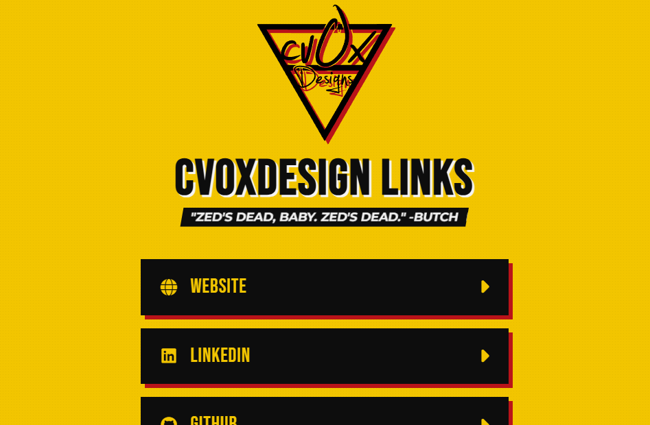

# Pulp Fiction Linktree Theme 🍔🔫

A custom, responsive "Linktree" style landing page with a **Pulp Fiction** movie theme. Designed for [cvOxDesign](https://cvoxdesign.com).



## Features

- **Iconic Design**: Uses the classic Yellow (`#F2C500`), Red (`#B91319`), and Black color palette.
- **Typography**: "Bebas Neue" for headers and "Montserrat" for body text, mimicking the movie poster style.
- **Dynamic Links**: Links are configured in `script.js` for easy maintenance.
- **Random Quotes**: Displays a random *Pulp Fiction* quote from `pulp_fiction_quotes.js` on every page load.
- **Responsive**: Fully responsive single-column layout that works great on mobile devices.
- **Animations**: Staggered fade-in animations for link cards.

## Setup

No build process required! This is a simple static site.

1. Clone the repository.
2. Open `index.html` in your web browser.

## Customization

### Adding/Removing Links
Open `script.js` and modify the `links` array:

```javascript
 const links = [
    {
        title: 'My Link',
        url: 'https://example.com',
        icon: 'fa-solid fa-link' // FontAwesome class
    },
    // ...
];
```

### Changing Quotes
Open `pulp_fiction_quotes.js` to add or remove quotes from the list.

## Technologies

- HTML5
- CSS3 (Variables, Flexbox, Animations)
- JavaScript (Vanilla)
- FontAwesome 6.6.0
- Google Fonts

---
*"I’m Winston Wolf. I solve problems."*